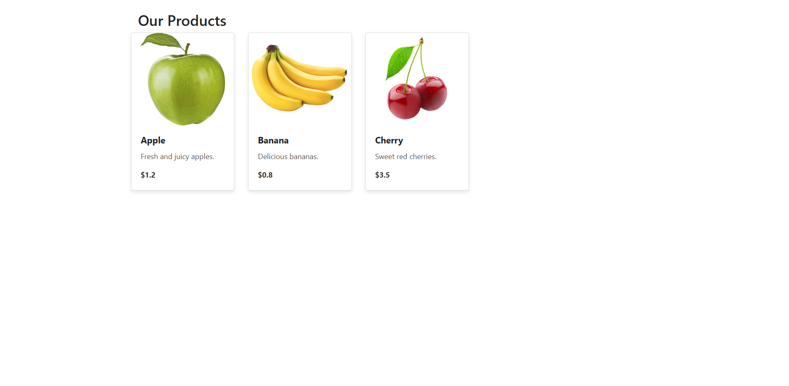

### **How to Use:**

1. Save the `index.html` file and `dom.js` file.
2. Add images like `apple.png`, `banana.png`, and `cherry.png` in the same folder as the HTML file.
3. Open the HTML file in a browser to see the dynamically generated product cards.

---

### **Notes**:

- This documentation includes the main HTML structure, JavaScript logic for dynamically creating cards, and how to set up the project.
- You can edit or add products in the `products` array in the `dom.js` file to update the cards on the page.

### **Notes**:

- The `styles.css` file is optional, but it greatly enhances the appearance of the cards, adding hover effects and a clean layout.
- You can modify the CSS to further tweak the design or add animations and more interactive features.

## Theme
